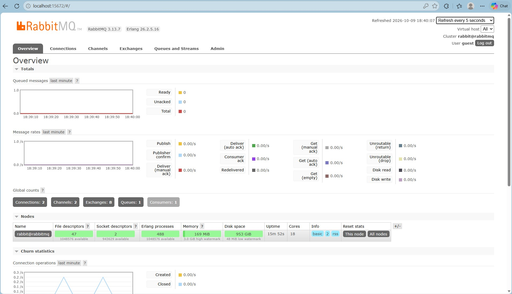
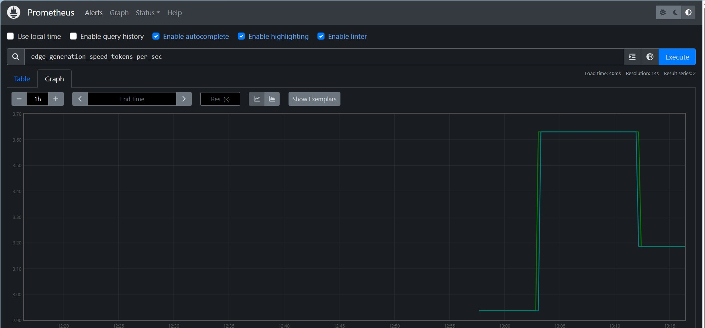
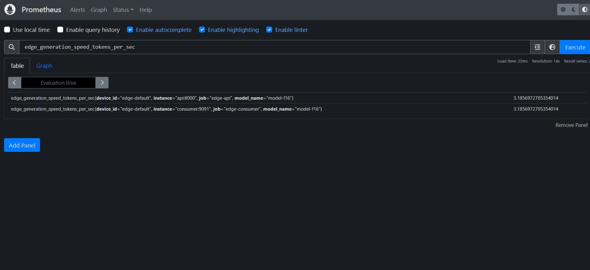
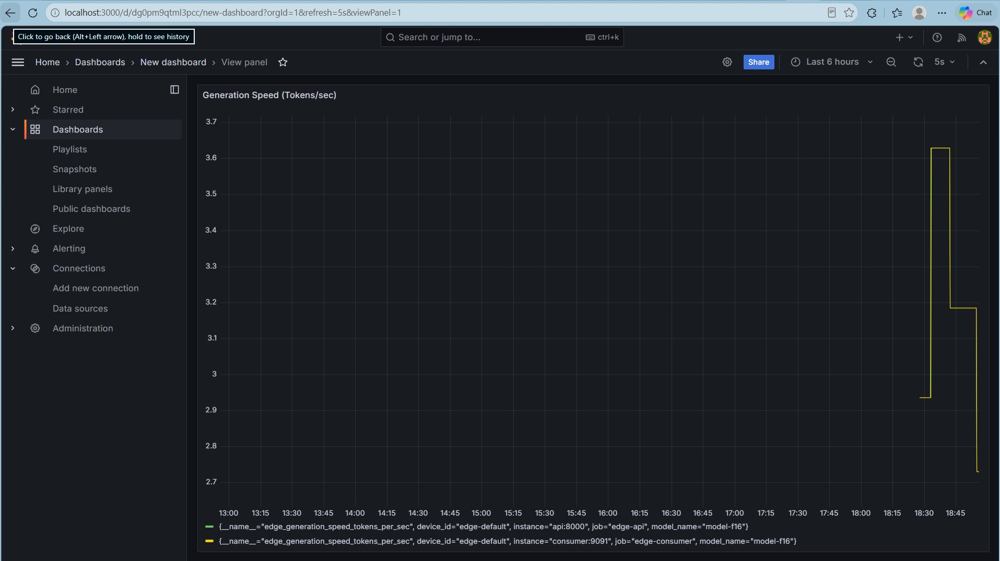
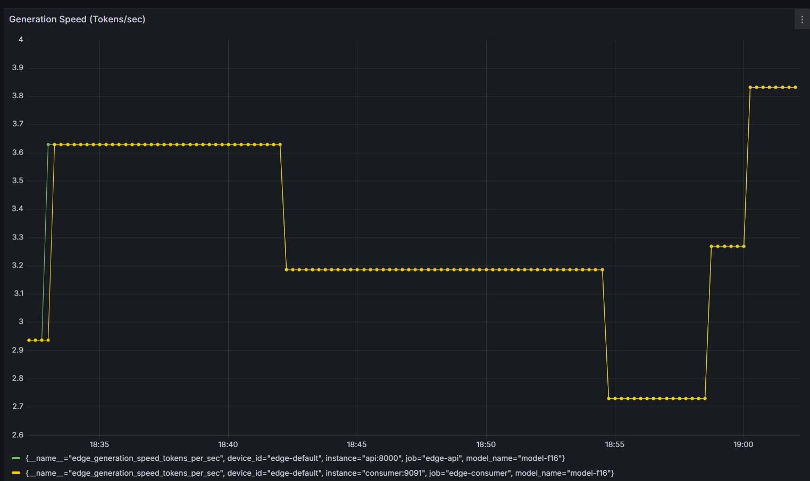

# 🌐 Edge-LLM Quantization & Monitoring Mesh

> Deploy quantized LLMs to edge devices with robust offline-first telemetry — even over unstable networks.

[](https://python.org)
[](LICENSE)
[](https://docs.docker.com/compose/)

---

## 📋 Table of Contents

- [Problem Statement](#-problem-statement)
- [Architecture](#-architecture)
- [Directory Structure](#-directory-structure)
- [3-Step Workflow](#-3-step-workflow)
  - [Step 1: Push Code to GitHub](#step-1-push-code-to-github)
  - [Step 2: Quantize on Kaggle](#step-2-quantize-on-kaggle-dual-t4-gpus)
  - [Step 3: Run Edge + Server Locally](#step-3-run-edge--server-locally)
- [Component Deep Dives](#-component-deep-dives)
- [Monitoring & Dashboards](#-monitoring--dashboards)
- [Configuration Reference](#-configuration-reference)
- [Contributing](#-contributing)

---

## 🎯 Problem Statement

Deploying LLMs to edge devices presents a unique MLOps challenge:

1. **Models are too large** — a 7B-parameter model needs 14 GB in FP16. Edge devices can't handle this.
2. **Networks are unreliable** — edge sites may have intermittent connectivity. Telemetry can't rely on always-on connections.
3. **Observability is fragmented** — without centralized monitoring, you're flying blind across dozens of edge deployments.

**This project solves all three:**

| Problem | Solution |
|---|---|
| Model too large | 4-bit GGUF quantization on Kaggle (Dual T4 GPUs) — shrinks 14 GB → ~4 GB |
| Unreliable network | Offline-first SQLite cache + circuit breaker daemon on edge |
| Fragmented observability | Central RabbitMQ → Prometheus → Grafana telemetry mesh |

---

## 🏗 Architecture

```
┌─────────────────────────────────────────────────────────────────┐
│                        KAGGLE (Dual T4)                        │
│  ┌───────────────────────────────────────────────────────┐     │
│  │  quantize_pipeline.py                                 │     │
│  │  HuggingFace Model → F16 GGUF → Q4_K_M GGUF          │     │
│  └───────────────────────┬───────────────────────────────┘     │
│                          │ Download .gguf artifact              │
└──────────────────────────┼─────────────────────────────────────┘
                           ▼
┌─────────────────────────────────────────────────────────────────┐
│                     EDGE DEVICE (Local)                        │
│  ┌─────────────────┐    ┌──────────────────────────────┐      │
│  │  inference.py    │───▶│  local_cache.db (SQLite)     │      │
│  │  (llama-cpp)     │    │  Offline-first telemetry     │      │
│  └─────────────────┘    └──────────┬───────────────────┘      │
│                                     │                          │
│  ┌──────────────────────────────────▼──────────────────┐      │
│  │  telemetry_client.py                                │      │
│  │  Circuit breaker · Batch flush · Exponential backoff│      │
│  └──────────────────────────────────┬──────────────────┘      │
└─────────────────────────────────────┼─────────────────────────┘
                                      │ POST /ingest/telemetry
                                      ▼
┌─────────────────────────────────────────────────────────────────┐
│                    CENTRAL SERVER (Docker)                      │
│  ┌───────────┐    ┌──────────┐    ┌────────────┐    ┌───────┐ │
│  │  FastAPI   │───▶│ RabbitMQ │───▶│  Consumer   │───▶│Prom.  │ │
│  │  :8000     │    │  :5672   │    │  Worker     │    │:9090  │ │
│  └───────────┘    └──────────┘    └────────────┘    └───┬───┘ │
│                                                         │      │
│                                         ┌───────────────▼───┐  │
│                                         │     Grafana       │  │
│                                         │     :3000         │  │
│                                         └───────────────────┘  │
└─────────────────────────────────────────────────────────────────┘
```

---

## 📁 Directory Structure

```
edge-llm-mesh/
├── quantization/
│   ├── requirements.txt          # PyTorch, transformers, HF Hub
│   └── quantize_pipeline.py      # Kaggle-ready: download → convert → quantize
├── edge_node/
│   ├── requirements.txt          # llama-cpp-python, psutil, requests, pika
│   ├── inference.py              # LLM runner with auto-telemetry
│   ├── telemetry_client.py       # Circuit breaker daemon
│   └── local_cache.db            # Auto-created SQLite cache
├── central_server/
│   ├── docker-compose.yml        # Full stack: RabbitMQ + API + Prometheus + Grafana
│   ├── prometheus.yml            # Scrape config
│   ├── api/
│   │   ├── Dockerfile
│   │   ├── main.py               # FastAPI ingest + /metrics + /health
│   │   └── requirements.txt
│   └── consumer/
│       ├── Dockerfile
│       └── process_metrics.py    # RabbitMQ → Prometheus exporter
├── .gitignore
└── README.md
```

---

## 🚀 3-Step Workflow

### Step 1: Push Code to GitHub

```bash
# Clone (or initialize) the repository
git clone https://github.com/Nilanjan899/Edge-LLM-Mesh.git
cd Edge-LLM-Mesh

# (If starting fresh, the code is already here — just push)
git add -A
git commit -m "feat: scaffold Edge-LLM Mesh — quantization, edge client, central server"
git push -u origin main
```

### Step 2: Quantize on Kaggle (Dual T4 GPUs)

> **Why Kaggle?** Quantizing a 7B model needs ~24 GB VRAM for the conversion step. Kaggle gives you Dual T4 GPUs (2×16 GB) for free.

Open a **new Kaggle Notebook** with **GPU T4 ×2** accelerator and paste these cells:

**Cell 1 — Clone & Install:**
```bash
!git clone https://github.com/Nilanjan899/Edge-LLM-Mesh.git /kaggle/working/Edge-LLM-Mesh
%cd /kaggle/working/Edge-LLM-Mesh/quantization
!pip install -q -r requirements.txt
```

**Cell 2 — Build llama.cpp (CMake):**
```bash
!git clone https://github.com/ggerganov/llama.cpp /kaggle/working/llama.cpp
%cd /kaggle/working/llama.cpp
!pip install -q -r requirements.txt
!cmake -B build -DGGML_CUDA=ON -DCMAKE_LIBRARY_PATH=/usr/local/cuda/lib64/stubs
!cmake --build build --config Release -j$(nproc)
```

**Cell 3 — Run Quantization:**
```bash
%cd /kaggle/working/Edge-LLM-Mesh/quantization
!python quantize_pipeline.py \
    --model-id "microsoft/Phi-3-mini-4k-instruct" \
    --quant-type "q4_k_m" \
    --output-dir "/kaggle/working/quantized_models"
```

**Cell 4 — Verify Output:**
```python
import os
output_dir = "/kaggle/working/quantized_models"
for f in os.listdir(output_dir):
    size_gb = os.path.getsize(os.path.join(output_dir, f)) / 1e9
    print(f"{f} → {size_gb:.2f} GB")
```

**Cell 5 — Download:** Use the Kaggle UI to download the `.gguf` file from `/kaggle/working/quantized_models/`, or use the Kaggle API:

```bash
# From your local machine:
kaggle kernels output <your-username>/<notebook-slug> -p ./models/
```

### Step 3: Run Edge + Server Locally

#### 3a. Start the Central Server

```bash
cd central_server
docker compose up -d
```

Verify services are running:

| Service | URL | Credentials |
|---|---|---|
| FastAPI Docs | http://localhost:8000/docs | — |
| RabbitMQ Management | http://localhost:15672 | guest / guest |
| Prometheus | http://localhost:9090 | — |
| Grafana | http://localhost:3000 | admin / edgemesh |

#### 3b. Start the Edge Node

```bash
cd edge_node
pip install -r requirements.txt

# Start inference (interactive mode)
python inference.py \
    --model ../models/phi-3-q4_k_m.gguf \
    --interactive \
    --n-gpu-layers -1

# In a separate terminal, start the telemetry daemon
python telemetry_client.py \
    --server-url http://localhost:8000 \
    --interval 30
```

Every inference call automatically logs to `local_cache.db`. The telemetry daemon picks up un-synced rows and flushes them to the central server.

---

## 🔍 Component Deep Dives

### Edge Node — Offline-First Telemetry

The edge client follows the **Circuit Breaker / Offline-First** pattern:

```
inference.py logs metrics
       │
       ▼
┌──────────────────┐
│  local_cache.db  │  ← Always written first (never lost)
│  (SQLite + WAL)  │
└────────┬─────────┘
         │
         ▼
┌────────────────────────────────────┐
│  telemetry_client.py (daemon)      │
│                                    │
│  CLOSED ──[3 failures]──▶ OPEN    │
│    ▲                        │      │
│    │                   [backoff]   │
│    │                        ▼      │
│  [success] ◀── HALF_OPEN ──┘     │
│                  (probe)           │
└────────────────────────────────────┘
```

**Key design decisions:**
- **WAL journal mode** on SQLite for safe concurrent reads/writes.
- **Thread lock** (`threading.Lock`) guards all DB access.
- **Exponential backoff** (10s → 20s → 40s → … → 300s max) prevents hammering a down server.
- **Batch flush** (default 50 rows) minimizes HTTP round-trips.

### Central Server — Message Broker Architecture

Why RabbitMQ instead of direct DB writes?

1. **Decoupling** — The API just publishes; consumers can scale independently.
2. **Durability** — Persistent messages survive RabbitMQ restarts.
3. **Back-pressure** — If consumers lag, messages queue up safely.

### Quantization Pipeline — Kaggle-Optimized

The pipeline runs three steps:
1. **Download** — `huggingface_hub.snapshot_download()` pulls model weights.
2. **Convert** — `llama.cpp/convert_hf_to_gguf.py` produces an F16 GGUF.
3. **Quantize** — `llama-quantize` compresses to 4-bit (Q4_K_M).

The intermediate F16 file is automatically deleted to stay within Kaggle's disk limits.

---

## 📊 Monitoring & Dashboards

### Available Prometheus Metrics

| Metric | Type | Labels | Description |
|---|---|---|---|
| `edge_generation_speed_tokens_per_sec` | Gauge | device_id, model_name | Tokens/sec from edge |
| `edge_memory_usage_mb` | Gauge | device_id | RAM usage on edge |
| `edge_vram_usage_mb` | Gauge | device_id | VRAM usage (if GPU) |
| `edge_ttft_ms` | Gauge | device_id, model_name | Time to first token |
| `edge_inference_total_time_ms` | Histogram | device_id | Full inference latency |
| `edge_telemetry_ingested_total` | Counter | device_id | Records ingested |
| `consumer_records_consumed_total` | Counter | device_id | Records processed |

### Grafana Setup

1. Open Grafana at http://localhost:3000 (admin / edgemesh).
2. Add Prometheus data source → URL: `http://prometheus:9090`.
3. Import or create dashboards querying the metrics above.

**Example PromQL queries:**

```promql
# Average generation speed across all devices
avg(edge_generation_speed_tokens_per_sec)

# Memory usage per device (last 1h)
edge_memory_usage_mb{device_id=~".*"}

# Ingestion rate (records/min)
rate(edge_telemetry_ingested_total[5m]) * 60
```

---

## ⚙ Configuration Reference

### Environment Variables

#### Edge Node

| Variable | Default | Description |
|---|---|---|
| `EDGE_DEVICE_ID` | `edge-default` | Unique identifier for this edge device |
| `EDGE_TELEMETRY_DB` | `./local_cache.db` | Path to the SQLite telemetry cache |

#### Central Server

| Variable | Default | Description |
|---|---|---|
| `RABBITMQ_HOST` | `rabbitmq` | RabbitMQ hostname |
| `RABBITMQ_PORT` | `5672` | RabbitMQ AMQP port |
| `RABBITMQ_USER` | `guest` | RabbitMQ username |
| `RABBITMQ_PASS` | `guest` | RabbitMQ password |
| `RABBITMQ_EXCHANGE` | `edge_telemetry` | Exchange name |
| `METRICS_PORT` | `9091` | Consumer Prometheus port |

---

## 🤝 Contributing

1. Fork the repository.
2. Create a feature branch: `git checkout -b feat/my-feature`.
3. Commit changes: `git commit -m "feat: add my feature"`.
4. Push: `git push origin feat/my-feature`.
5. Open a Pull Request.

---

## 📜 License

MIT License — see [LICENSE](LICENSE) for details.

---

## 📸 Screenshots

### RabbitMQ Management UI


### Prometheus
**Graph View:**


**Table View:**


### Grafana Dashboards


**Peak Token Generation Speed:**

*The peak token generation speed achieved in my local machine was 3.83.*
